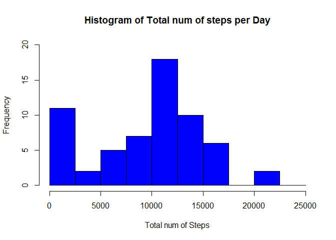
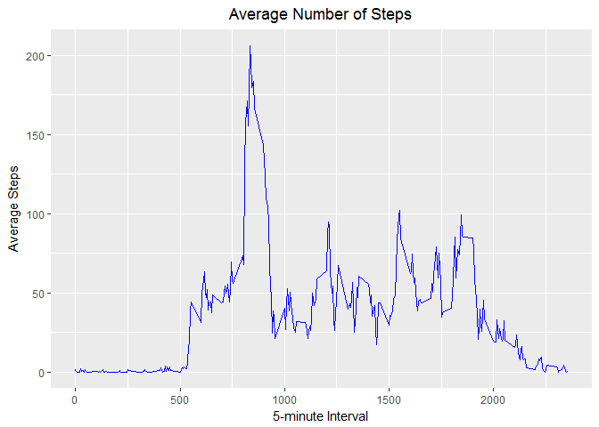
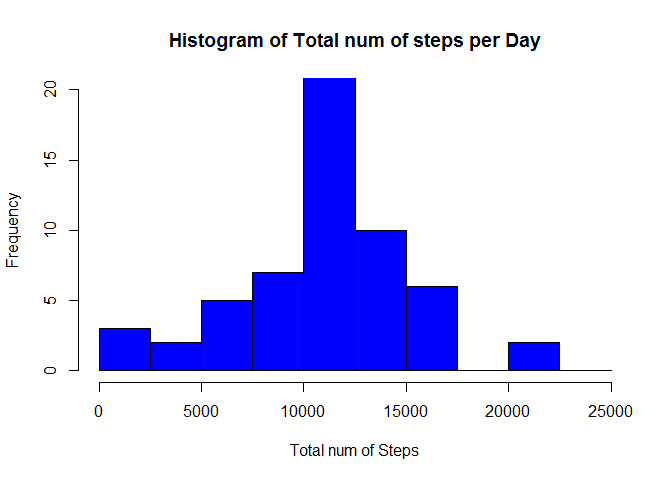
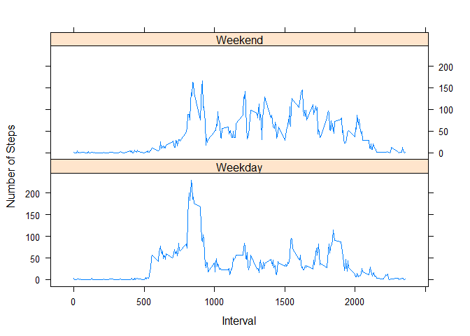

Activity Monitoring Analysis
============================

``` r
library(ggplot2)
library(dplyr)
library(lattice)
```

### Loading and preprocessing the data

*1.Load the data*

``` r
data<-read.csv("activity.csv")
```

*2.Transform date variable to date format*

``` r
data$date<-as.Date(data$date)
```

### What is mean total number of steps taken per day?

*1.Calculate total number of steps per day*

``` r
data_Q1<-data%>%group_by(date)%>%summarize(steps_total=sum(steps,na.rm=T))%>%select(date,steps_total)
```

*2.Histogram of total number of steps*

``` r
hist(data_Q1$steps_total,breaks=seq(0,25000,2500),ylim=c(0,20),col="blue",xlab="Total num of Steps",main="Histogram of Total num of steps per Day")
```



*3.Report Mean and Median of total number of steps*

``` r
mean_steps<-mean(data_Q1$steps_total,na.rm=T)
median_steps<-median(data_Q1$steps_total,na.rm=T)
```

*mean\_steps:9354.23 median\_steps 10395*

### What is the average daily activity pattern?

*1.Calculate average steps per 5-minute interval across a day*

``` r
data_Q4<-data%>%group_by(interval)%>%summarize(steps_average=mean(steps,na.rm=T))%>%select(interval,steps_average)
```

*2.Make a time series plot of 5-minute interval and average number of steps*

``` r
ggplot(data_Q4,aes(interval,steps_average))+geom_line(col="blue")+xlab("5-minute Interval")+
  ylab("Average Steps")+ggtitle("Average Number of Steps")+theme(plot.title = element_text(hjust = 0.5))
```



*3.Which 5-minute interval contains the maximum number of steps?*

``` r
max_index<-which.max(data_Q4$steps_average)
max_interval<-data_Q4[max_index,]$interval
```

*max\_interval:835*

### Imputing missing values

*1.Calculate total number of missing values*

``` r
per_step_mis<-mean(is.na(data$steps))
```

*per\_step\_mis(13.11%)is missing percentage in steps variable*
*2.Fill the missing values by the mean of corresponding 5-minute interval *

``` r
data_miss<-data
for (i in 1:dim(data_miss)[1]){
  if (is.na(data_miss[i,]$steps)){
    data_miss[i,]$steps<-data_Q4[data_Q4$interval==data_miss[i,]$interval,]$steps_average
  }
}
```

*3.Calcluate and Create Histogram for total number of steps after missing values are imputed*

``` r
data_miss_hist<-data_miss%>%group_by(date)%>%summarize(steps_total=sum(steps))%>%select(date,steps_total)
hist(data_miss_hist$steps_total,breaks=seq(0,25000,2500),ylim=c(0,20),col="blue",xlab="Total num of Steps",main="Histogram of Total num of steps per Day")
```



*4.Report Mean and Median of total number of steps*

``` r
mean_steps_miss<-mean(data_miss_hist$steps_total,na.rm=T)
median_steps_miss<-median(data_miss_hist$steps_total,na.rm=T)
```

*mean\_steps\_miss:10766.19 median\_steps\_miss:10766.19*

### Are there differences in activity patterns between weekdays and weekends?

*1.Create day variable that contain two levels-"weekday" and "weekend";Calculate average steps for 5-minute interval across weekday or weekend*

``` r
data_miss$day<-ifelse(weekdays(data_miss$date)%in%c("Monday","Tuesday","Thursday","Wednesday","Friday"),"Weekday","Weekend")
average_step<-data_miss%>%group_by(interval,day)%>%summarize(steps_mean=mean(steps))%>%select(day,steps_mean,interval)
```

*2.Make Panel Plot*

``` r
xyplot(steps_mean~interval|day,average_step,
       type="l",
       lwd=1,
       xlab="Interval",
       ylab="Number of Steps",
       layout=c(1,2))
```


